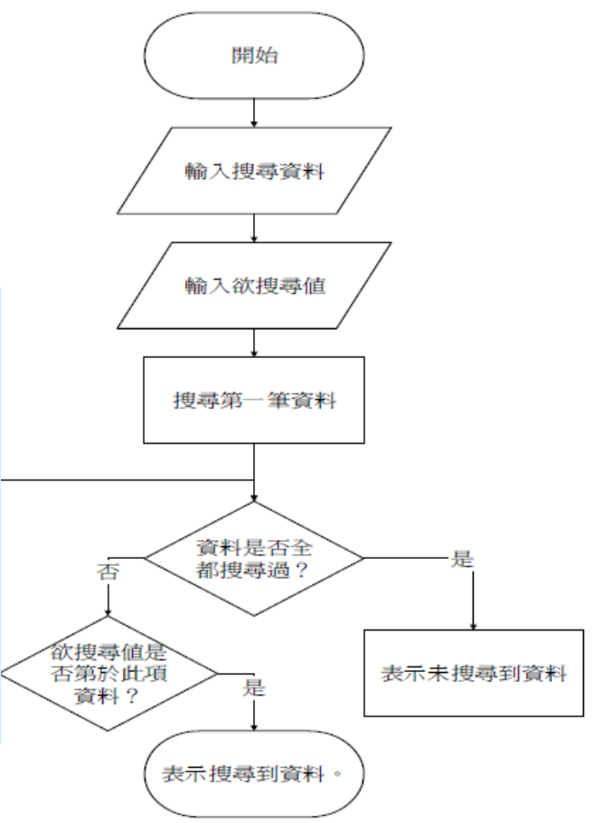
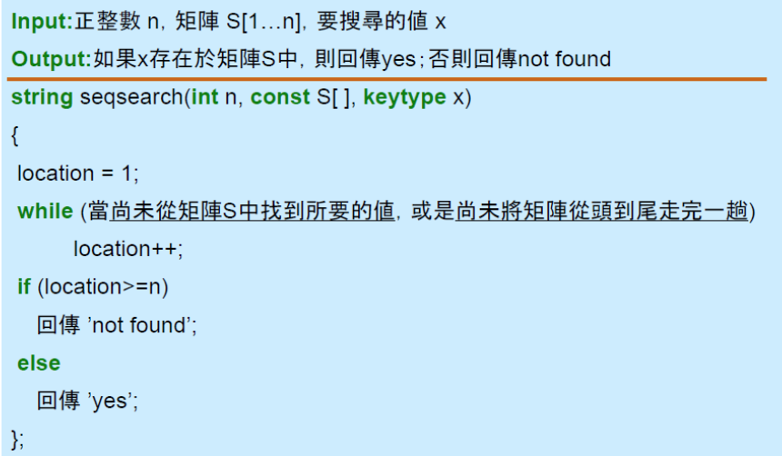

# 演算法
只要是利用電腦解決問題的步驟，就能稱為演算法。通常在針對某一問題開發程式時，都會經過下列流程：<br>
Step 1:明確定義問題<br>
Step 2:設計演算法（流程圖）<br>
<br>
Step 3:計算其執行時間及所使用的記憶體空間大小 （虛擬碼）<br>
<br>
Step 4:撰寫程式<br>


## QuickSort

```python
def quick_sort(list): #extra-place
    smaller = []
    bigger = []
    keylist = []
    if len(list) <= 1:
        return list
    else:
        key = list[0] #第一個數為key值
        for i in list:
            if i < key: #比key值小的數
                smaller.append(i)
            elif i > key: #比key值大的數
                bigger.append(i)
            else:
                keylist.append(i)
    smaller = quick_sort(smaller)
    bigger = quick_sort(bigger)
    return smaller + keylist + bigger
```


## HeapSort

```python
def swap(g, h):                    
    arr[g], arr[h] = arr[g], arr[h] 

def heapify(n,i):   
    l=2 * i + 1  
    r=2 * (i + 1)   
    max=i   
    if l < n and arr[i] < arr[l]:   
        max = l   
    if r < n and arr[max] < arr[r]:   
        max = r   
    if max != i:   
        swap(i, max)   
        heapify(n, max)   

def heap_sort():     
    n = len(arr)   
    s = n // 2 - 1 
    for i in range(s, -1, -1):   
        heapify(n, i)   
    for i in range(n-1, 0, -1):   
        swap(i, 0)   
        heapify(i, 0) 
```

## MergeSort

```python
def merge_sort(arr):
    if len(arr)<=1:   
        return arr
    else:
        mid = len(arr)//2 
        left = arr[:mid] 
        right = arr[mid:]
        l_arr = merge_sort(left)      
        r_arr = merge_sort(right)
        return merge(l_arr,r_arr)

    
def merge(l_arr,r_arr):
    final = []
    while l_arr and r_arr:
        if l_arr[0] < r_arr[0]:
            
            final.append(l_arr[0])
            del l_arr[0]

        else:
            final.append(r_arr[0])
            del r_arr[0]
            
    final = final + l_arr + r_arr
    return final

```
## BinarySearchTree
```python
class TreeNode(object):
    def __init__(self, x):
        self.val = x
        self.left = None
        self.right = None

class solution(object):
    def insert(self, root, key):
        if root is None:
            root = TreeNode(key)
            return root
        else:
            if key > root.val:
                root.right = self.insert(root.right,key)
            else:
                root.left = self.insert(root.left,key)
            return root


            

    def search(self, root, key):
        if root is None :
            return False
        elif root.val == key:
            return True
        elif key > root.val:
            return self.search(root.right,key)
        elif key < root.val:
            return self.search(root.left,key)


        
    def inorder(self,root): 
        if root: 
            self.inorder(root.left) 
            print(root.val) 
            self.inorder(root.right) 
            
            
                    
    def findmin(self,root):
        while root.left is not None:
            root = root.left
        return root
    
    
    
    def delete(self,root,key):
        if root is None:
            return False
        elif key > root.val:
            root.right = self.delete(root.right, key)
        elif key < root.val:
            root.left = self.delete(root.left, key)


        else:   
            if root.left is None:
                replace = root.right  
                root = None            
                return replace         
            elif root.right is None:  
                replace = root.left
                root = None
                return replace

            
            else:  
                replace = self.findmin(root.right) 
                root.key = replace.key 
                root.right = self.delete(root.right,replace.key)
            return root
```

## HashTable
```python
from Crypto.Hash import MD5

class ListNode:
    def __init__(self, val):
        self.val = val
        self.next = None

        
class MyHashSet:
    def __init__(self, capacity=5):
        self.capacity = capacity
        self.data = [None] * capacity

        
    def add(self, key):
        h = MD5.new()
        h.update(key.encode("UTF-8"))
        arr = int(h.hexdigest() , 16)%self.capacity
        if self.data[arr] is None:
            self.data[arr] = ListNode(h)        
        else:
            n = ListNode(h)
            o = self.data[arr]
            while o.next is not None:
                o = o.next
            o.next = n
        
        
        
        
    def remove(self, key):
        h = MD5.new()
        h.update(key.encode("UTF-8"))
        arr = int(h.hexdigest() , 16)%self.capacity
        brr = int(h.hexdigest() , 16)
        n = self.data[arr]
        if self.data[arr]:
            cur = n
            while n.val != brr and n.next:
                n = n.next  
            cur.next = n.next
        else:
            return

        

        
    def contains(self, key):
        h = MD5.new()
        h.update(key.encode("UTF-8"))
        arr = int(h.hexdigest() , 16)% self.capacity
        brr = int(h.hexdigest() , 16)
        head = self.data[arr]
        if head is None:
            return False
        else:
            while head.val != brr:
                head = head.next
                if head is None: 
                    return False
            return True           
```

## BFS & DFS
```python

from collections import defaultdict
  

class Graph:

    def __init__(self): 
        self.graph = defaultdict(list) 

    def addEdge(self,u,v): 
        self.graph[u].append(v) 
  

    def BFS(self, s):
        visited = [0] * (len(self.graph)) 
        que = [] 
        que.append(s) 
        visited[s] = 1 
        while que:
            s = que.pop(0)
            print(s, end=',')
            for i in self.graph[s]:
                if visited[i] == 0:
                    que.append(i)
                    visited[i] = 1
                    

    def DFS(self, s):
        stack = []
        a=[]
        a.append(s) #直接把根放進去
        while len(a) != len(self.graph):
            for i in self.graph[s]:
                if i not in stack and i not in a:
                    stack.append(i)
            s=stack.pop(-1)
            a.append(s)
        return a

```
## Dijkstra & Kruskal

```python
from collections import defaultdict 

class Graph(): 

    def __init__(self, vertices): 
        self.v = vertices 
        self.graph = [] 
        self.graph_matrix = [[0 for column in range(vertices)]  
                    for row in range(vertices)] 
        
    def addEdge(self,u,v,w):
        self.graph.append([u,v,w]) 
        
    def Dijkstra(self, s):
        visited = [False] * self.v 
        dist = [99999] * self.v 
        dist[s] = 0
        for i in range(self.v):
            m = self.find_min(dist,visited,i)
            visited[m] = True
            for r in range(self.v):
                if self.graph[m][r] > 0 and  visited[r] == False and dist[r] > dist[m] + self.graph[m][r]:
                    dist[r] = dist[m] + self.graph[m][r]
        for node in range(self.v): 
            print (node, ":", dist[node])
                    
                 
    def find_min(self,dist,visited,root):
        min = 99999
        for v in range(self.v):
            if dist[v]<min and visited[v] == False:
                min = dist[v]
                min_index = v
        return min_index
        
                
            
    def Kruskal(self):
        h=0
        subset=set() 
        MST=[]
        self.graph =  sorted(self.graph,key=lambda item: item[2]) 
        
        for m in self.graph:
            t = set(m[:2]) 
            if t.issubset(subset) == False:
                subset.update(m[:2])
                MST.append(m)

        while h < len(MST):
            print(MST[h][0],"-",MST[h][1],":",MST[h][2])
            h = h+1
```

